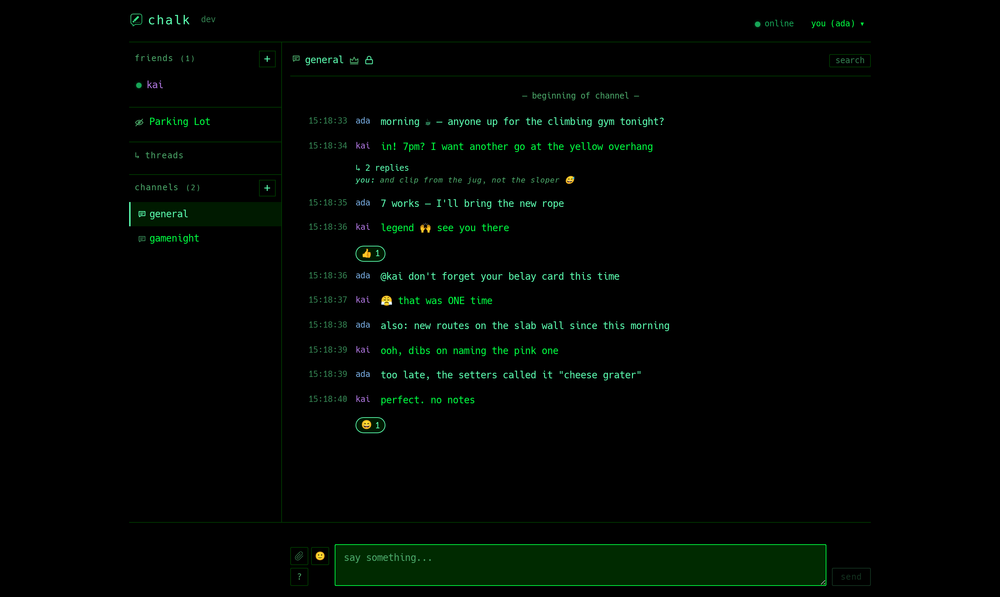
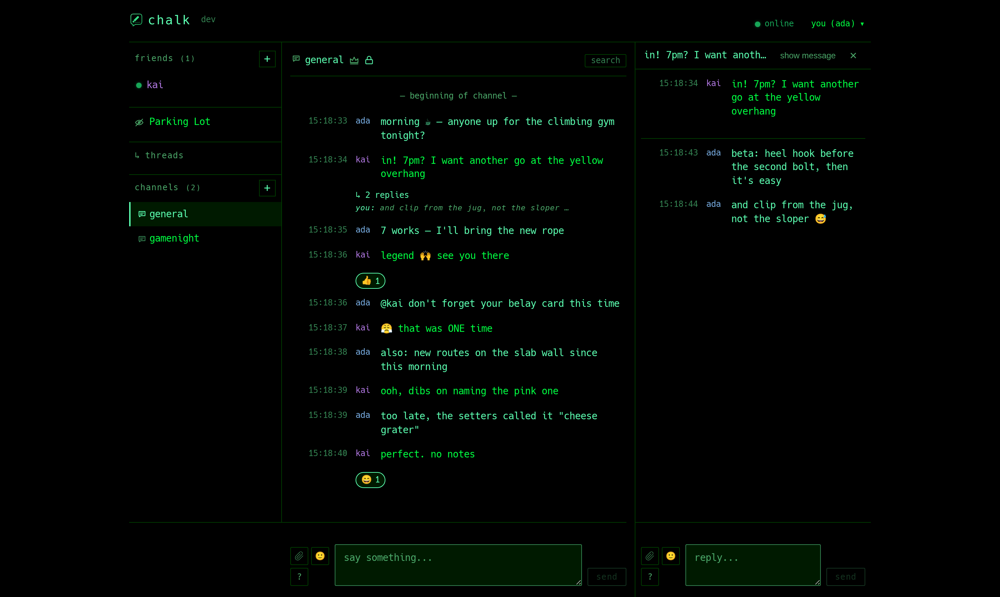
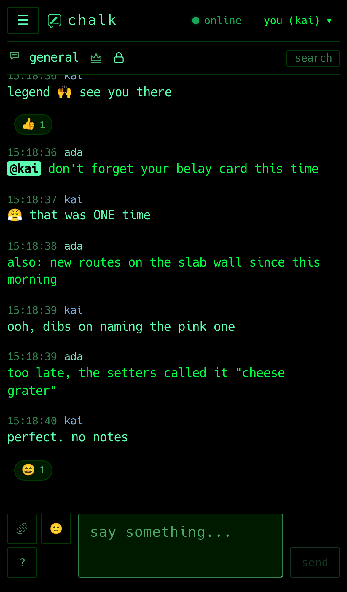

<p align="center">
  
</p>

<h1 align="center">chalk</h1>

A self-hosted, end-to-end-encrypted group chat: one Go binary, Postgres, and a
browser client. Matrix-green-on-black by default (thirteen themes, four
bundled monospace fonts),
Slack-style threading, Discord-style voice/video rooms.

Accounts are password + TOTP; passkeys are an optional convenience on top,
never a bypass of the second factor.

> **Crypto status.** chalk is **end-to-end encrypted**. Messages, edits,
> reactions and attachments are encrypted client-side under per-channel space
> keys (identity-wrapped, native WebCrypto, AES-256-GCM); the server stores
> only ciphertext. Two intended guarantees are **not met yet**: channel-key
> wraps are not signed, so a *malicious* server can still substitute a key it
> knows, and messages carry no sender signature. See
> [docs/threat-model.md](docs/threat-model.md) for what holds today, what
> doesn't, and the metadata the server sees regardless.

## What's in it

- **Messaging** — channels, DMs and threads; replies; @mentions; per-user
  unread tracking with a new-messages divider, synced across your devices.
- **Message actions** — react with emoji, edit your own message within 15
  minutes (marked `(edited)`), and delete under per-channel rules: your own
  words are always yours to retract, someone else's are the channel owner's
  call in dictator mode or a vote in democratic mode.
- **Attachments & GIFs** — encrypted uploads with encrypted previews,
  drag-drop / clipboard paste, and Giphy behind a per-user opt-in.
- **Voice & video** — voice channels with a WebRTC mesh, coturn as the
  mandatory relay, screen/game sharing and adaptive quality. Off by default
  (`CHALK_VOICE_ENABLED`).
- **Governance** — each channel is `dictator` or `democratic`; membership
  changes, deletions and mode changes can run as proposals the members vote on.
- **Accounts** — password + mandatory TOTP, optional passkeys, two separate
  24-word phrases (one resets your login, one is your encryption identity),
  and multi-device onboarding by re-entering the encryption phrase.
- **Client** — desktop and mobile layouts, installable as a PWA, thirteen
  themes, per-device font and text-size settings (Hack, JetBrains Mono, Fira
  Code and Cascadia Code all bundled), per-user nick colours.
- **Ops** — `chalkctl` deploys, updates, backs up and migrates a whole host
  from cosign-verified container images, with a maintenance page for when the
  app is down on purpose.

## Screenshots

The default theme (six more in settings), on a dev instance:







## Quick start (development)

Requirements: Go 1.25+, Node 20+, Docker 24+, Bash 5.2+, `make`, `git`.

```sh
git clone https://github.com/scuq/chalk
cd chalk
make dev          # Postgres + chalkd + SPA, foreground on :8443
```

Then open <http://127.0.0.1:8443/> and sign up: pick a handle, set a password
(at least 20 characters across 4 character classes), scan the TOTP QR code, and
write down both 24-word phrases. To test a two-user flow, register a second
account in another browser profile (or a private window) and add them as a
friend from the first.

Stop with Ctrl-C; `make dev-down` removes the Postgres container.

To take the reserved admin account, set `CHALK_ADMIN_USERNAME`,
`CHALK_ADMIN_EMAIL` and `CHALK_ADMIN_BOOTSTRAP_TOKEN` before starting, then
open `/?admin_token=<token>` and complete signup. The claim is one-shot: once
the admin account has credentials, the URL does nothing.

## Deploying it

`chalkctl` is the deployment manager — one binary that installs and runs a
whole chalk host:

```sh
chalkctl init      # verify + pin the image, render config, bring everything up
chalkctl status    # deployed version, digest, service states
chalkctl update    # verify, swap, health-check, roll back on failure
chalkctl up        # start the stack; `down` stops it
chalkctl backup    # encrypted archive of the database + env + config
chalkctl restore   # load such an archive into an initialized host
chalkctl maint     # on|off|status — serve a notice instead of the app
chalkctl metrics   # what postgres knows about its own performance
chalkctl images    # version/revision/created for each image in the stack
chalkctl reconfigure-turn   # re-render + restart coturn only
```

It renders podman Quadlet units for chalkd, Postgres and coturn, sets up Caddy
for TLS, verifies GHCR pulls with cosign, and installs a weekly update timer.
See [docs/deployment.md](docs/deployment.md).

### Backups

```sh
chalkctl backup --out /root/chalk.chalkbak
```

One password-encrypted file (Argon2id + AES-256-GCM) holding the database —
every message, channel, membership, device and attachment, since attachment
ciphertext is a database column rather than a file — plus `chalk.env` and
`chalkctl.conf`. The env file matters as much as the dump: `CHALK_TOTP_ENC_KEY`
is what the stored TOTP secrets are encrypted under, and a database restored
without it locks every account out at the second factor.

The password comes from `--password-file`, `$CHALK_BACKUP_PASSWORD` or a
prompt, and there is no recovery path if it is lost. Nobody is interrupted
while a backup runs: `pg_dump` reads a consistent snapshot. Every Postgres
command runs inside the container, so the host needs no `psql`.

### Moving to a new host

```sh
# old host
chalkctl maint on --message "moving to a new server, back by 14:00 UTC"
chalkctl backup --out /root/chalk.chalkbak
scp /root/chalk.chalkbak newhost:/root/

# new host — a normal fresh init first, so Caddy issues real certificates
# and the stack is proven healthy before any data is at stake
chalkctl init --domain chat.example.org --rootful \
    --admin-username <name> --admin-email <addr>
chalkctl restore /root/chalk.chalkbak
chalkctl maint off
```

`restore` requires an initialized host and never touches the units, the
Caddyfile or the image pin. It replaces exactly two things: the contents of the
database, and `CHALK_TOTP_ENC_KEY` in the env file. Everything else `init`
generated stays, because it belongs to the host actually serving — its Postgres
password, its TURN secret, its WebAuthn RP ID.

It streams the archive in one pass, showing the source domain, version and
backup date and asking you to confirm before anything is written, and the load
runs as a single transaction: a restore either lands completely or leaves the
database as it was.

**Keep the domain the same** if you can. Passkeys are bound to it, so a rename
invalidates them — everyone can still sign in with password + TOTP and enrol a
new passkey. Sessions, identities and message history survive either way. If
the domain does change, point DNS at the new host before `init`, or Caddy
cannot issue a certificate.

### Metrics

```sh
chalkctl metrics              # sizes, cache hit ratio, growth, bloat, bad plans
chalkctl metrics --sample 30s # two readings, reported as rates
```

Reads only Postgres' in-memory statistics views, so it costs no table I/O and
is safe on a busy host — no `count(*)`, no `pgstattuple`, no summing attachment
bytes. Row counts are planner estimates and attachment volume comes from
partition sizes, which is also why growth-per-month is free: `messages` and
`attachments` are partitioned monthly, so the partition sizes *are* the curve.

It surfaces the things that explain a slow server: cache hit ratio, anything
sitting idle-in-transaction (which blocks autovacuum database-wide), tables
being read start-to-finish, dead rows autovacuum has not reclaimed, indexes
never read, and checkpoints forced by WAL volume. Per-query timings are opt-in
via `chalkctl init --force --pg-stat-statements`, since collecting them costs a
little on every statement.

### Maintenance mode

```sh
chalkctl maint on --message "back by 14:00 UTC"
chalkctl maint off
```

Re-renders only the Caddyfile so Caddy answers every request itself with a 503
notice, then reloads it in place. Caddy stays up, so the certificate keeps
renewing while the app is down — without this, stopping chalkd leaves everyone
on a bare 502. `/healthz` still reaches chalkd, so `update` and `restore` can
tell a healthy app from a hidden one, and `init --force` preserves the mode
rather than putting the site back in front of users mid-repair.

## Desktop app

chalk also ships as a desktop app for **Windows, macOS and Linux** (phase
104, record in [docs/phases/PHASE-104-DESKTOP.md](docs/phases/PHASE-104-DESKTOP.md)).
It is an Electron shell around your server's own page — nothing of chalk is
bundled into it, so it is always exactly as current as the server it opens —
plus the things a browser tab cannot do:

- **links open in your system default browser**, whatever the app is built on;
- **close to tray**: closing the window keeps chalk connected, notifications
  keep arriving, the tray icon brings it back; *Quit* is in the tray and the menu;
- **away detection that sees the whole desktop** (how long since you touched
  the machine, and the screen lock on Windows and macOS), with no browser
  permission prompt;
- calls, screen sharing (its own picker), passkeys, notifications and the
  output-device picker work as in Chrome, because it *is* Chromium.

**Download.** Every release carries `chalk-desktop-<version>-<os>-<arch>`
archives — `windows-x64`/`windows-arm64` (zip), `macos-arm64`/`macos-x64`
(zip with `chalk.app`), `linux-x64`/`linux-arm64` (tar.gz) — next to
`SHA256SUMS.desktop`, which is cosign keyless-signed like the other assets.
Unpack anywhere and run `chalk`; it asks for your server the first time
(`https://…` only — the session cookie is `Secure`), remembers it, and
`Ctrl/Cmd+Shift+S` switches. `chalk --server https://chat.example.org` skips
the picker.

- **Windows** warns about an unknown publisher: the exe is signed with
  chalk's own self-signed certificate (`chalk-codesign.cer` is in the zip;
  import it into *Trusted Publishers* to silence SmartScreen). Toasts are
  attributed to "chalk" only after an installer exists; until then they say
  Electron.
- **macOS** is not notarized (no Apple developer account): the first launch
  needs right-click → *Open*. Passkeys need a native module the shell does
  not have yet; password + TOTP works.
- **Linux** needs a tray host for the icon (KDE, XFCE, MATE have one; GNOME
  needs an AppIndicator extension — without it the window still hides on
  close and comes back by launching `chalk` again). `chalk
  --install-desktop-entry` writes a launcher entry and icon under
  `~/.local/share` pointing at wherever you unpacked it.

**Updates.** The app checks GitHub once a day and tells you when a newer
release exists (a one-time dialog, then an entry in the tray and the *chalk*
menu) — the link opens the release page; installing is still by hand. One-click
self-update is planned as phase 105. `"checkUpdates": false` in `desktop.json`
(under the app's config directory, `chalk-desktop/`) turns the check off;
`"closeToTray": false` makes the close button quit.

## Architecture

See [docs/architecture.md](docs/architecture.md). In short: a stateless
multi-instance Go server using Postgres as both storage and pub/sub bus
(LISTEN/NOTIFY), with a Preact browser client over a JSON WebSocket
protocol ([docs/wire-protocol.md](docs/wire-protocol.md)). Each instance
holds only in-memory socket state; Postgres is the source of truth.

## Accounts and cryptography in a nutshell

In one breath: you log in with a password and a 6-digit TOTP code, you hold a
separate 24-word phrase that is the seed of your cryptographic identity, and
that identity locks your messages so only the people in a channel can read
them. **All of it is live — messages and attachments are end-to-end encrypted,
and the server stores only ciphertext.** Here is every piece in plain language.

| Piece | What it does, plainly | Status |
|---|---|---|
| Password + Argon2id | Your password never leaves the browser. It is stretched with Argon2id (256 MiB, 3 passes) into a master key; the server only ever sees a derived proof value, and stores only a hash of that. | live |
| TOTP (RFC 6238) | A 6-digit code from your authenticator, required on **every** login — including the passkey path. Mandatory, not optional. | live |
| Passkeys (WebAuthn) | Optional convenience: unlock with your device's fingerprint/PIN instead of typing the password. Still asks for the TOTP code, so a stolen device is not an account. | live |
| Recovery phrase (24 words) | Your way back into the account if you forget the password. It **resets** your login rather than logging you in, and the server stores only a slow Argon2id hash of it. | live |
| Encryption phrase (24 words, BIP-39) | A second, separate phrase: 256 bits of randomness with a checksum, and the root of your cryptographic identity. Never leaves your browser; it is what lets a new device read your history. | live |
| PBKDF2-HMAC-SHA512 | Stretches those 24 words into a 64-byte seed (the standard BIP-39 step). | live |
| HKDF-SHA256 | Splits one seed into independent keys, so the signing key and the encryption key never overlap. | live |
| X25519 | Your encryption keypair. Two people's X25519 keys can agree on a shared secret without ever sending it — that secret wraps the keys that lock a channel's messages. | live |
| Ed25519 | Your signing keypair. Proves "this identity really is mine," and signs the X25519 key so the server can't quietly swap it (the self-signature). | live |
| Self-signature | Your Ed25519 key signs your X25519 key. When someone fetches your identity, they check this signature, so a malicious server can't substitute a fake encryption key undetected. | live |
| Space keys + AES-256-GCM | Each channel has one shared symmetric key that actually encrypts the messages, edits, reactions and attachments. It's handed to each member by wrapping it under their X25519 public key, and rotated when someone is removed. | live |
| Picture-word verification | An out-of-band check (you compare the same picture/words with someone) to be sure no one is sitting in the middle swapping keys. | live |
| Phrase rotation + recovery | You can roll your encryption phrase to a fresh one; old keys are re-wrapped so you keep your history, with an opt-out for when you're rotating because the old phrase leaked. | live |
| Signed voice fingerprints | In a call, each peer's DTLS fingerprint is signed with their Ed25519 key and checked against their published identity. A mismatch aborts that peer instead of degrading to an unverified call. | live |
| TLS 1.3 | Encrypts the connection between your browser and the server, like every HTTPS site. | live |

A few deliberate choices worth knowing: every primitive above is **native
WebCrypto** — chalk bundles no cryptography library and ships no WASM. The
encryption phrase is the one and only decryption secret, so guard it like a
wallet seed: lose it and lose those messages, leak it and leak them. And two
things are explicit **non-goals**, not oversights: forward secrecy (old
messages staying safe if a key later leaks) and post-quantum resistance. The
full reasoning, threat model, and recovery design live in
[docs/threat-model.md](docs/threat-model.md) and [docs/design/](docs/design/).

## Documentation

- [docs/architecture.md](docs/architecture.md) — system overview
- [docs/wire-protocol.md](docs/wire-protocol.md) — the `chalk.v1` WebSocket protocol
- [docs/threat-model.md](docs/threat-model.md) — current state + planned guarantees
- [docs/browser-support.md](docs/browser-support.md) — supported engines + minimum versions
- [docs/deployment.md](docs/deployment.md) — running it in production with `chalkctl`
- [docs/theming.md](docs/theming.md), [docs/notification-sounds.md](docs/notification-sounds.md) — client customization
- [docs/phases/PHASE-31-AUTHV2.md](docs/phases/PHASE-31-AUTHV2.md) — the password + TOTP auth design, as built
- [docs/design/](docs/design/) — design specs (multi-device, attachments, the phase-30 voice/video plan, crypto agility)
- [docs/phase-log.md](docs/phase-log.md) — the build history (what shipped, when) and roadmap

Release-by-release notes in plain language are in
[CHANGELOG.md](CHANGELOG.md); the phase-by-phase engineering history is in
[docs/phase-log.md](docs/phase-log.md). (This README intentionally doesn't
track phase status — see those instead.)

## License

BSD-3-Clause — see [LICENSE](LICENSE).

chalk's licensing has changed over its life: MIT through the 9.x series,
then GPL-3.0-or-later in phase 11a to align with the (now-removed)
@wireapp/core-crypto dependency, and — with that dependency gone after the
21-series rip-out — back to the permissive BSD-3-Clause. Relicensing was
done by the sole copyright holder; commits remain available under whichever
license was in effect when they were made.
